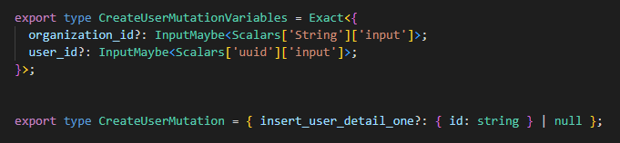
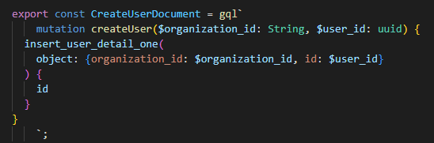
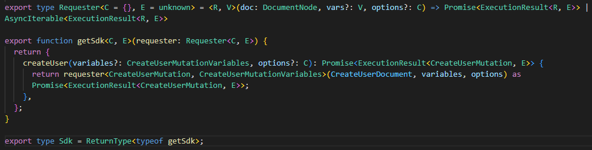
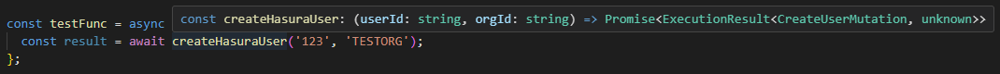
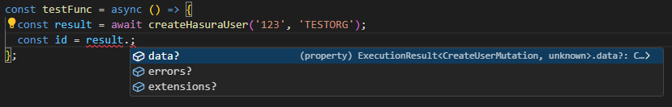
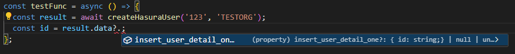

In the last few months, the Catalog Engineering team has been hard at work on a new app to improve our customer's course curation process. This app connects to our new Hasura GraphQL API, to which we make requests for, and to mutate, data. Early on, we made the decision to not use a dedicated GraphQL client (e.g., apollo) and so we got used to creating TypeScript types for our GraphQL requests/responses as we needed them. This worked fine in the beginning as our app only had a few simple requests. However, as the number and complexity of these requests/responses grew, it became apparent that we needed a better solution.

Enter [graphql-codegen](https://the-guild.dev/graphql/codegen) - a CLI tool that allows you to generate typed queries, mutations, subscriptions, and more based on your GraphQL schema. With graphql-codegen we were able to remove all of our manual types and generate new (and better!) types on the fly. This post will walk through how we connected the tool to our Hasura GraphQL schema, how we're able to make use of those types, and walkthrough setting up a custom 'SDK' that makes calling our methods a breeze. Let's get started!

## Installation

Note: *the following steps assume you have a working TypeScript app that is connected to an established Hasura GraphQL API with at least one GraphQL query/mutation/subscription*

First, you'll need to install the tool and a few dependencies. Run the following:

```shell
npm i graphql graphql-config
```

And a few dev dependencies (we'll talk a bit more about some of these later):

```shell
npm i -D @graphql-codegen/cli @graphql-codegen/typescript @graphql-codegen/typescript-operations @graphql-codegen/typescript-generic-sdk
```

## Configuration

Next, create a GraphQL config file (detailed information on `graphql-config` can be found [here](https://the-guild.dev/graphql/config/docs)):

```typescript
// graphql.config.ts

import type { IGraphQLConfig } from 'graphql-config';
import { loadEnv } from 'vite';

const { HASURA_ADMIN_SECRET, VITE_GRAPHQL_API_URL } = loadEnv('', process.cwd(), '');

const config: IGraphQLConfig = {
  schema: [
    {
      [VITE_GRAPHQL_API_URL]: {
        headers: {
          'x-hasura-admin-secret': HASURA_ADMIN_SECRET,
        },
      },
    },
  ],
  documents: 'src/**/*.graphql',
  extensions: {
    codegen: {
      overwrite: true,
      generates: {
        'src/__generated__/graphql.ts': {
          plugins: ['typescript', 'typescript-operations', 'typescript-generic-sdk'],
          config: {
            skipTypename: true,
            namingConvention: {
              typeNames: 'change-case-all#pascalCase',
              enumValues: 'change-case-all#upperCase',
            },
            rawRequest: true,
            scalars: {
              uuid: 'string',
            },
          },
        },
      },
    },
  },
};

export default config;
```

A few notes about the above config:

* We are using Vite as our build tool. We import several environment variables via Vite's `loadEnv`. The `schema` config will be the same for you - just pop in your Hasura GraphQL API URL and admin secret and you should be set
* Plugins allows for tons of custom configuration. We've chosen several customization that work well for us, but you might choose something differe. Also, make note of the `typescript-generic-sdk` plugin - we'll talk more about that later

## An Example Mutation

Let's quickly walk through the example mutation that we'll be reference moving forward. Our Hasura GraphQL schema has a table called `users`, so we'll need a way to add new `users`. In order to do that, we'll use the following mutation:

```graphql
# src/graphql/createUser.graphql

mutation createUser($organization_id: String, $user_id: uuid) {
  insert_user_detail_one(object: { organization_id: $organization_id, id: $user_id }) {
    id
  }
}
```

As you can see, this mutation takes an `organization_id` and `user_id` and returns the user's `id`

## Generating Types

Now that we have our mutation and the tool is configured, let's see what our generated output looks like. We can run `npm run graphql-codegen` to kick that off

Once finished, you should see `src/__generated__/graphql.ts`. Looking inside, we can see types for the mutation and the mutation's variables:



as well as a `const` for the GraphQL document:



Pretty cool, right?! Now, how can we make use of these types? Since we're not using something like Apollo, we'd need to wire up our Hasura requester to handle our newly generated mutation variables, return types, and the GraphQL document - that sounds like a lot of work, right?! This is where we can make use of that 'SDK' mentioned earlier

## Putting Everything Together

If we continue searching in `graphql.ts`, we'll see that we also have a type for a requester and an 'SDK' which has everything neatly typed and ready to go:



All we need to do at this point is to implement the requester and we should be able to call the `createUser` method from the 'SDK'. That might look something like this:

```typescript
// hasuraRequester.ts

import { DocumentNode, ExecutionResult } from 'graphql';
import { getSdk } from '../__generated__/graphql';

const requester = async <R, V>(doc: DocumentNode, variables?: V, options?: { jwt: string }) => {
  const requestBody = { query: doc.loc?.source.body, variables };
  const requestOptions = {
    method: 'POST',
    headers: {
      'Content-Type': 'application/json',
      Authorization: `Bearer ${options?.jwt}`,
    },
    body: JSON.stringify(requestBody),
  };

  const response = await fetch(import.meta.env.HASURA_API_URL, requestOptions);
  return (await response.json()) as ExecutionResult<R, unknown>;
};

const sdk = getSdk(requester);

const createHasuraUser = (userId: string, orgId: string) => {
  return sdk.createUser({ organization_id: orgId, user_id: userId });
};

export default createHasuraUser;
```

If we import the 'SDK', we should now have typing around calling the `createHasuraUser` method:



and we see the typed response:



and if we keep going, we also see the `id` mentioned earlier would be available to us

