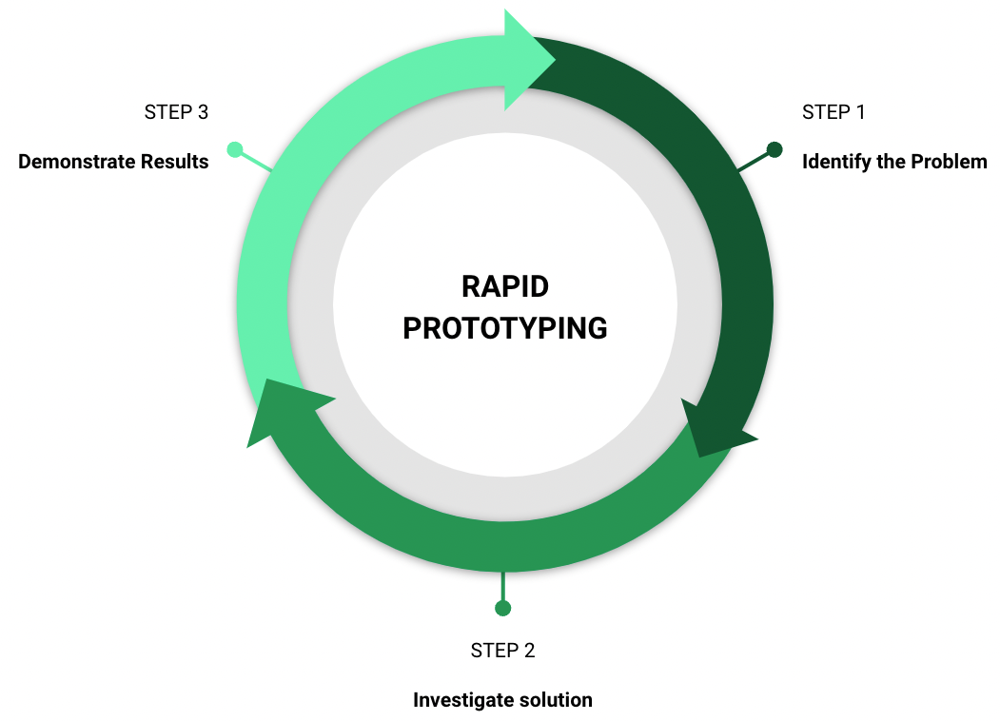
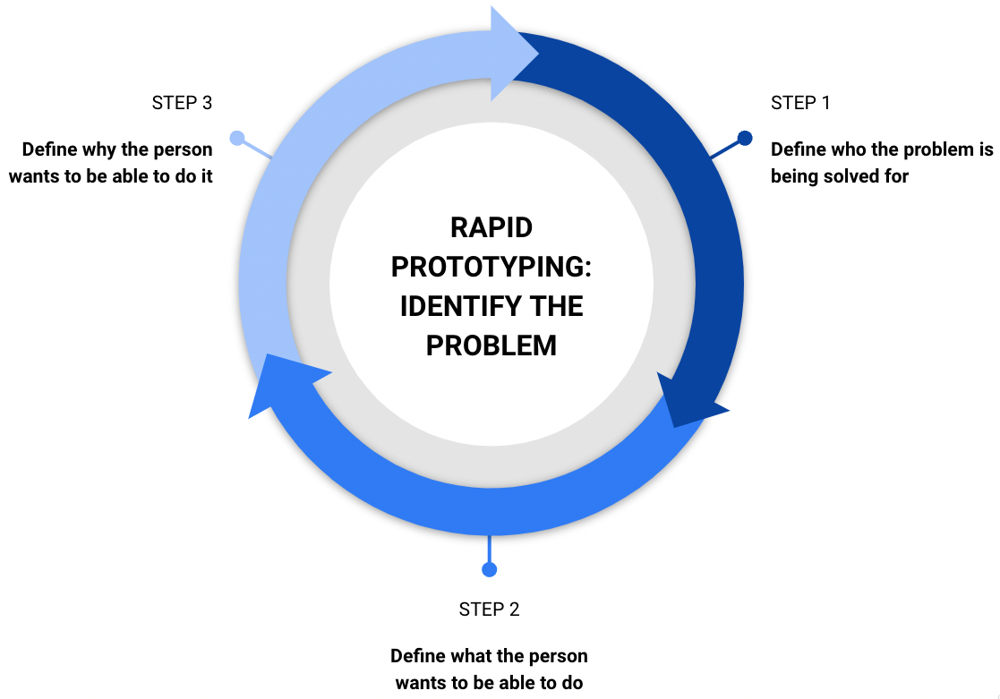
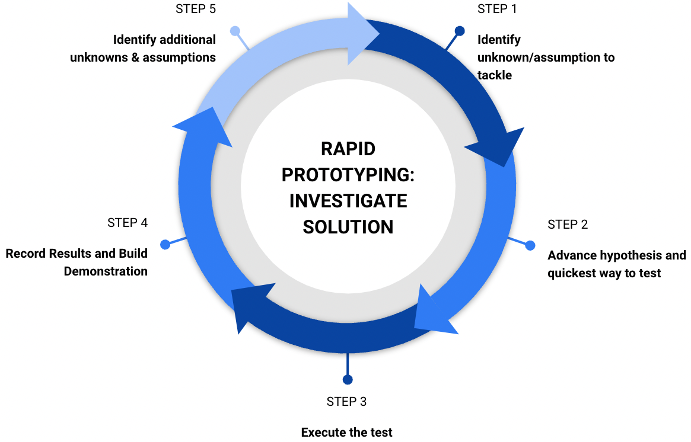
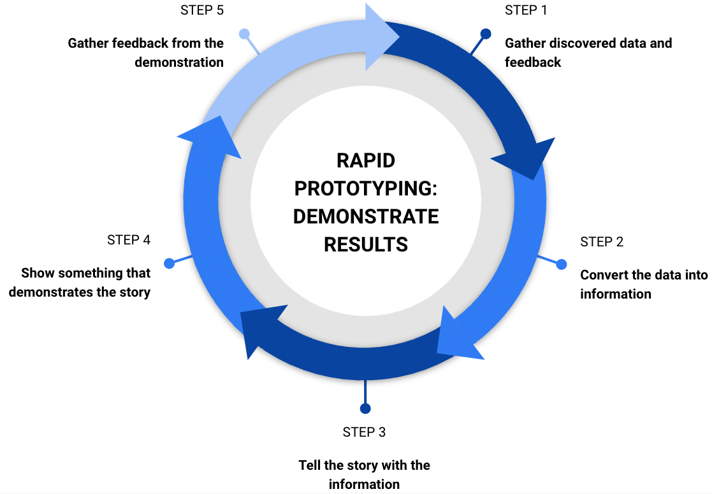

Rapid prototyping is using the scientific method to quickly (usually within a single day) prove an approach to solving a problem.

For software engineers, rapid prototyping is usually used to test a technological solution's usability and functionality. Rapid prototyping can also be done to quickly create testable UI/UX experiments that can be presented to a group of users to identify the best design. Rapid prototyping does not always include writing code or building software.

## Principles

These are the principles that should be followed during the rapid prototyping process:

* Always investigate the parts of the problem that is least understood first.
* Usually investigate the easiest parts of the problem that are least understood first.
* Always use the scientific process to investigate the solution.
* Always take the time to clearly demonstrate the results of the experiments used to investigate the solution.
* Always look for ways to demonstrate your prototypes and experiment outcomes on a daily cadence.

## Process

For each problem:

## Identify the Problem

### 1. Define who the problem is being solved for.

When attempting to solve a problem, identify the stakeholders who are experiencing the issue. Knowing the people allows you to better target the solution and understand the underlying problems. It is rare that a problem is simple.

For example, you might be told that you need to figure out how to create an HLS stream from a set of files - video, captions and secondary audio. That seems like an easy problem, but the audience can matter greatly. Is the audience technically savvy enough to be able to get an OAuth token with the correct scopes and call an API endpoint that has dozens of required parameters? Or must the solution abstract all requirements in as simple a method as possible so that they do not have to understand the process before starting?

The audience is an integral part of the problem to solve. And there may be multiple audiences! Identify the problem for EACH person that needs the solution!

### 2. Define what the person wants to be able to do.

The next most important part of identifying the problem is describing what the person wants to do. Try to avoid placing a specific solution in this statement. Do not write: “Joe wants a button on the lower left of the page that processes the form through system X” - that isn’t really what Joe wants (though that might be what Joe insists on!). A better statement might be, “Joe wants to be able to send the invoice information to system X.” The new statement opens the door to finding the best possible solution for what Joe needs.

### 3. Define why the person wants to be able to do it.

The final part of the problem statement is crucial when someone is trying to implement a solution. WHY someone wants to be able to do something allows the solver to change direction and pick a better solution if the original path ends up being a dead end. For example, suppose Joe wants to be able to send invoice information to system X because system X is the system of record for that information. In that case, the solver will need to ensure the information gets to system X. They will realize that it’s not an acceptable alternative to send that information to system B instead - unless system B ALSO sends the information needed to system X.

## Investigate a Solution

### 1. Identify the unknown or assumption about the solution that will be tackled next.

Given any problem and a potential solution, there will be proven hypotheses about the answer, unproven hypotheses that we believe to be true or false (assumptions) and unproven hypotheses that we don’t know to be true or false (unknowns).

Categorizing each hypothesis in the buckets of *proven*, *assumed*, and *unknown* can be a powerful way of prioritizing the work needed to establish a solution. Remember that a proven hypothesis must be able to be demonstrated, even if the team didn’t create the demonstration.

When prioritizing, follow this order:

1. Prefer investigating unknowns to assumptions
2. Prefer investigating the most difficult items that can be proven the quickest first

### 2. Advance a hypothesis about the unknown or assumption and identify the quickest way to test (prove or disprove) the hypothesis

A hypothesis proposes that, given specific inputs, a particular outcome will be achieved. For example, Terraform can be used to provision an AWS S3 bucket with publicly accessible contents for any source. The inputs are not necessarily explicit in this example. They may need to be investigated further, but the outcome is crystal clear, and the hypothesis can be proven or falsified through an experiment. The experiment, in this example, might be following the Terraform documentation to create an AWS S3 bucket and reviewing the resulting bucket in AWS to see if it has the expected properties - perhaps by downloading a file from the bucket from multiple browsers on different machines in different locations.

### 3. Execute the test.

Once the best and quickest test approach has been identified - get it done! The idea is to get the data you need to prove or disprove the hypothesis as quickly as possible - be aware this may not involve any coding or even using an application.

It is important to remember that executing a test usually involves more than a few unknowns - things go wrong! When they do go wrong, you will want to identify the following items quickly:

1. Do I need to resolve the issue, or can I go around it?
2. Is there another way to execute the test that I can try out?
3. Is there another test I can perform to get the data I need?
4. If this is the only way forward, and I need to solve the problem, how long should I spend on it before reaching out for help? And what is the best source for help to use?

### 4. Record the results and use the results to build a demonstration.

When the test is complete, you should have some data that can be used to prove or disprove your hypothesis. Take the time to record the uncovered data, and ensure the results can be shared with the audience intended for your prototype.

Recording everything can take more time than executing the test! That is okay; demonstrating your test results is at least as necessary as performing the test in the first place.

Make sure the demonstration of the results is compelling, clear and appropriately presented for your audience - the information you provide should help your audience understand what the test results imply and build consensus about the next steps to proving the hypothesis.

### 5. Identify any additional unknowns or assumptions about the solution that have been uncovered.

Tests usually do not provide data that proves or disproves anything conclusively without any possibility of disagreement. In most scientific studies, the conclusions section includes paragraphs of ideas about how to investigate the hypothesis further to clear up additional identified assumptions or unknowns discovered during the study. The conclusion almost ALWAYS recommends further tests and investigations.

Don’t be discouraged if your tests turn up more unknowns than you had before running the test! Further understanding the hill that needs to be climbed to prove or disprove your hypothesis is an excellent outcome of your tests. Record your new unknowns and uncovered assumptions, and use that information to identify the next test that should be run.

## Demonstrate Results

### 1. Gather discovered data and feedback.

Data is the results of your tests and should not include any interpretation of what has been found. Here is an example of the difference between data and information:

| Data                                                                                       | Information                                                                                                                                               |
| ------------------------------------------------------------------------------------------- | --------------------------------------------------------------------------------------------------------------------------------------------------------- |
| Twelve percent of the requests to the endpoint returned a 404 error.                       | The endpoint has a high enough failure rate that, in order to use it and provide consistent results, we will need to retry our requests up to five times. |
| There are three documented methods available to use the service and get the data required. | There are three options to get the required data, and we will need to test each to determine which methods are the best option for our requirements.      |

Feedback is another significant output of your tests and the overall process. Feedback is information, requests or discoveries that come from what you’ve learned or from what has been gathered through the “demonstrate results” cycle. Feedback can come in the form of discovering additional unknowns, new existing assumptions, changes in the approach, problem statement or desired outcome.

### 2. Convert the data into information.

The data is interesting - and should be recorded and accessible to your stakeholders and team - now and in the future. However, it’s not particularly useful on its own. Take a look at the data, and offer an interpretation - what does the data mean? How does it affect your hypothesis? What changes should be made to the thesis? Should there be changes to the next step or experiment? Does the data point strongly that proving or disproving the hypothesis is complete?

### 3. Tell the story with the information.

Information is excellent - it is a great way to explore the data with the consumers of that information. It can guide and inform the process. However, it can also be boring, and a lot of information can be hard to synthesize, understand, and act on. The information gathered in your experiments is to indicate and decide upon action.

How do you build consensus around a course of action? Through telling a story. Find a way to explore the information - to explain why it is what it is and how it leads you to the conclusions you have reached. Whether that conclusion is “more tests needed - and here’s the next one” or “we’ve proven the hypothesis - the prototyping is complete,” the story carries the consumer along. It puts together a clear and compelling picture of what should be next.

### 4. Show something that demonstrates the story.

Stories are great. And sometimes, just reading a story is an inspiring experience. But these days, SHOWING your story is usually the most effective way of sharing what you have learned. Think about how you can show what you’ve learned in a way that your audience can easily understand and enjoy. Is it a quick demo of the click-through website that shows how to get the work done? A graphic with a couple of bullet points? A video that walks them through the problem, your data, and the interpreted results? Maybe it’s a course built in Simon?

Spend some time creating a presentation. The experiments and the tests - these are important - but to finish a prototype, you need to build understanding as well as consensus about the next steps - and a good demonstration can’t be beaten to meet those goals.

### 5. Gather feedback from the demonstration.

If you told a good story and demonstrated it well, your audience will be invested in the outcome and may have valuable feedback about what you’ve discovered. This feedback may help you decide what tests need to run next or give you a different direction - even a different hypothesis!

Record the feedback, and identify your action items. Then, do whatever is next!

| Word             | Definition                                                                                                                                                                                                                                                                     |
| ----------------- | ------------------------------------------------------------------------------------------------------------------------------------------------------------------------------------------------------------------------------------------------------------------------------ |
| hypothesis        | A supposition or proposed explanation made on the basis of limited evidence as a starting point for further investigation.                                                                                                                                                     |
| scientific method | A method of procedure that has characterized natural science since the 17th century, consisting in systematic observation, measurement, and experiment, and the formulation, testing, and modification of hypotheses.                                                          |
| user story       | A user story is a tool in Agile software development used to capture a description of a software feature from a user's perspective. The user story describes the type of user, what they want and why. A user story helps to create a simplified description of a requirement. |

## Resources

* [Back your prototypes with science — 8 methods explained](https://uxplanet.org/back-your-prototypes-with-science-8-methods-explained-cdd58d9a8f42 "https\://uxplanet.org/back-your-prototypes-with-science-8-methods-explained-cdd58d9a8f42")
* [User Stories](https://www.mountaingoatsoftware.com/agile/user-stories "https\://www.mountaingoatsoftware.com/agile/user-stories")
* [The scientific method](https://www.khanacademy.org/science/biology/intro-to-biology/science-of-biology/a/the-science-of-biology "https\://www.khanacademy.org/science/biology/intro-to-biology/science-of-biology/a/the-science-of-biology")