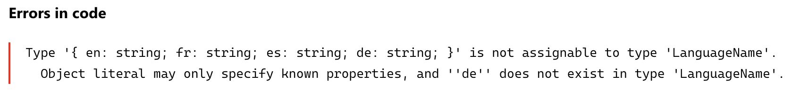
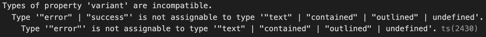

Even if you've been writing TypeScript for a while, you might not have ran across the language's built-in [utility types](https://www.typescriptlang.org/docs/handbook/utility-types.html). These come in handy and save you from having to manually implement some common type transformations. I'll go over a few utility types we use often and how you can put them to work in your code.

## Record

You can type an object with specific types for its keys and values using an [index signature](https://www.typescriptlang.org/docs/handbook/2/objects.html#index-signatures):

```typescript
type Book = { [isbn: number]: string; };
```

With the [Record](https://www.typescriptlang.org/docs/handbook/utility-types.html#recordkeys-type) type, you can represent the same object a bit more concisely:

```typescript
type Book = Record<number, string>;
```

If syntax were the only difference, I’d prefer the index signature since the `isbn` key gives more detail about the intent of the type; however, the `Record` type is a lot more powerful!

`Record` starts getting really useful when you want to lock down the properties of an object. In the above example, the object’s properties can be any string, but here's an example of using a [union type](https://www.typescriptlang.org/docs/handbook/typescript-in-5-minutes-func.html#unions) of strings for the keys:

```typescript
type Locale = 'en' | 'fr' | 'es';

type LanguageName = Record<Locale, string>;

const languages: LanguageName = {
  'en': 'English',
  'fr': 'French',
  'es': 'Spanish',
};
```

If I try to add German to this list, the compiler displays a nice error.



Another common use case is transforming the values of an object to a different type. Instead of maintaining a type that’s just used for the keys of other types, we can use the `keyof` keyword:

```typescript
const languages = {
  en: 'English',
  fr: 'French',
  es: 'Spanish',
};

type SupportedLanguages = Record<keyof typeof languages, boolean>;

const appLanguages: SupportedLocales = {
  en: true,
  es: true,
};
```

Again, there’s a nice error if an unexpected property is used.

## Partial

The [Partial](https://www.typescriptlang.org/docs/handbook/utility-types.html#partialtype) type makes all properties of a type optional. This is particularly useful for creating mock objects for testing. You can create a [factory function](https://medium.com/javascript-scene/javascript-factory-functions-with-es6-4d224591a8b1) that uses the desired type without needing to provide every value:

```typescript
interface Profile {
  name: string;
  avatar: string;
}

const createMockProfile = ({ name: 'Mock User', avatar: 'test.jpg' }: Partial<Profile>): Profile => ({
  name,
  avatar,
});

const testProfile = createMockProfile({ name: 'Test User' }); 

console.log(testProfile); // { name: 'Test User', avatar: 'test.jpg' }
```

The opposite of `Partial` is `Required`—it makes all the properties of a type required. 

## Pick and Omit

Sometimes you just need a subset of properties from a given type. Instead of creating a new type with values that are duplicated elsewhere in the codebase, you can use `Pick` and `Omit`.

[Pick](https://www.typescriptlang.org/docs/handbook/utility-types.html#picktype-keys) takes the given properties from a type. For example, we use `Pick` to build custom React components that wrap other third-party components in order to simply the interface:

```typescript
import Button, { ButtonProps } from '@mui/material/Button';

type CustomButtonProps = Pick<ButtonProps, 'color'>;

function CustomButton({ color }: CustomButtonProps) {
  return (
    <Button
      color={color}
      variant="contained"
  ...
}
```

This pattern helps enforce consistency since it limits the customization possible with props, but it also provides a simpler dev experience.

[Omit](https://www.typescriptlang.org/docs/handbook/utility-types.html#omittype-keys) works the opposite way: it filters out properties of a given type. This is useful when you want to use an existing type but overwrite one or more of its properties.

Maybe you already have the concept of a "variant" in your design system and you need to expose it as a prop for a custom button. You might try something like this:

```typescript
import Button, { ButtonProps } from '@mui/material/Button';

interface CustomButtonProps extends ButtonProps {
  variant: 'success' | 'error';
}
```

This won't compile because the custom `variant` type doesn't satisfy the constraints from `ButtonProps`. It's valid to narrow the type, i.e. `variant: 'contained'`, but you can't overwrite the properties of other interfaces this way.



The way around this is to use `Omit` to first remove the property from the type and then extend that filtered interface:

```typescript
import Button, { ButtonProps } from '@mui/material/Button';

interface CustomButtonProps extends Omit<ButtonProps, 'variant'> {
  variant: 'success' | 'error';
}
```

Both utility types can, of course, be combined and use multiple keys to make them even more expressive:

```typescript
interface CustomButtonProps extends Pick<Omit<ButtonProps, 'variant' | 'size'>, 'color' | 'type'> {
  variant: 'success' | 'error';
  size: 'tiny' | 'big';
}
```

## And Many More

Utility types can save you a lot of time and reduce complexity in your codebase. There are a lot more than what's covered here—you can try them all out in the official [TypeScript Playground](https://www.typescriptlang.org/play?&q=239). These examples just scratch the surface of what you can do with utility types and I hope they can help you improve your TypeScript.