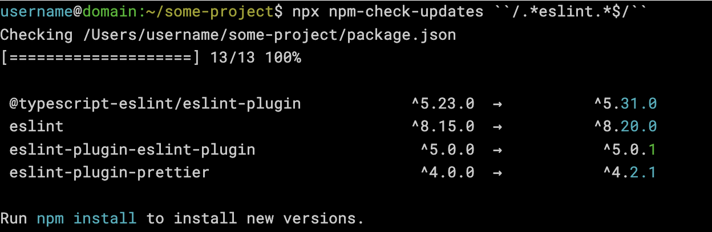

*Photo by [Alfons Morales](https://unsplash.com/@alfonsmc10?utm_source=unsplash&utm_medium=referral&utm_content=creditCopyText) on [Unsplash](https://unsplash.com/s/photos/library?utm_source=unsplash&utm_medium=referral&utm_content=creditCopyText)*

One of your dependencies needs to be upgraded, but it has several plugins or supporting packages. How can all of these packages be updated efficiently? Using [ESlint](https://eslint.org/) on a sample project, this post will show an easy way to check and update all of these packages.

## npm-check-updates

The [npm-check-updates](https://github.com/raineorshine/npm-check-updates) library allows you to check what updates are available for your dependencies. We want to check for updates on any packages that have a common word in their name, so `npm-check-updates` accepts as an argument a package name or regex. Execute the following in the root directory of the project  with the name of your dependency.

`npx npm-check-updates "/.*eslint.*$/"`

The regex will match all packages that have that word in the name:

For each package matching the regex, you will see the current version and the latest version. Check that the list of packages includes all that you want to update. If not, adjust the regex. 

Notice the color-coding of the version numbers. Any versions that are colored red indicate a major version, cyan indicates a minor version, and green means a patch upgrade. To upgrade every package on the list to the latest version, run the same command, but with the `-u` flag. This will modify package.json to have the latest version numbers.

Lastly, run `npm install` to install the new versions.

Before finishing, run any tests and linting checks. Changes to code will likely be needed depending on the upgrades done.